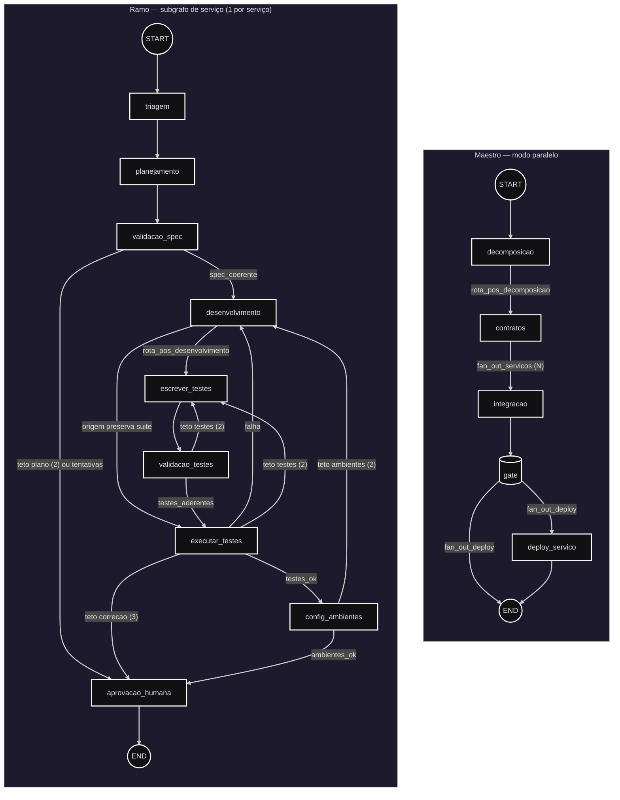

# Arquitetura do Grafo — Ramos, Gates e Tetos

Mapa em Mermaid do grafo de execução do **maestro** (modo paralelo) e do
**ramo de serviço** (subgrafo), com os gates (decisões condicionais) e os
tetos (`Teto`/circuit breaker) que devolvem o fluxo a um nó anterior.

Fonte da verdade: `src/squad/graph/workflow.py` e `src/squad/graph/maestro.py`;
os destinos de cada gate e os tetos exatos em `src/squad/dominio/rotas.py`.

## Legenda dos limites

| Limite | Constante | Valor | Efeito ao estourar |
| --- | --- | --- | --- |
| Plano/spec | `MAX_REPLANEJAMENTOS` | 2 | `validacao_spec` → `aprovacao_humana` (teto `planejamento`) |
| Testes escritos | `MAX_TESTES` | 2 | `validacao_testes`/`executar_testes` → `escrever_testes` (teto `escrever_testes`) |
| Correção de código | `MAX_TENTATIVAS` | 3 | `executar_testes` → `aprovacao_humana` (teto `correcao`) |
| Ambientes | `MAX_AMBIENTES` | 2 | `config_ambientes` → volta ao desenvolvimento |
| Visual | `MAX_VISUAL` | 2 | `visual` → segue para a `revisao` com os achados no estado |
| Revisão, pentest | `MAX_REVISOES`, `MAX_PENTEST` | 2 cada | cada gate → `aprovacao_humana` com relatório |
| Deploy (maestro) | — | — | `gate` global (`no_gate`, "PLACAR DA EXECUÇÃO") bloqueia o `fan_out_deploy` |

Nota: depois de `config_ambientes`, a ordem é `visual` → `revisao` →
`pentest` → `aprovacao_humana`. A verificação visual vem antes da revisão
desde a thread `af83302f`: é o juiz mais barato (determinístico, sem token), e
por último a reprova dela chegava com o orçamento de correção esgotado.
