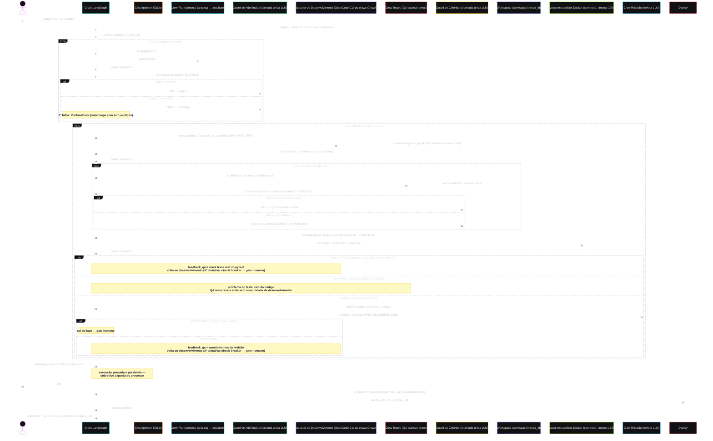

# Arquitetura — Diagrama de Sequência

Fluxo completo de uma execução após as Fases 1–7 do
[roadmap](DESENVOLVIMENTO-REAL.md): o disco (workspace) vira um ator, a
qualidade se divide em quatro participantes (crew de testes, guard de
critérios, pytest e crew de revisão) e o laço de correções é roteado pelo
**exit code do pytest** e pela **cobertura**, executados numa jaula Docker —
vereditos vêm de execução, não de opinião.

## Pontos estruturais

1. **Triagem toca o disco**: `workspace/<thread_id>/` é criado antes de
   qualquer LLM rodar; a entrega vive como arquivos, não como string no
   estado do grafo.
2. **Executor de desenvolvimento intercambiável**: `DEV_EXECUTOR` escolhe
   entre o OpenCode CLI (padrão) e as crews CrewAI. A governança é a mesma
   nos dois casos — o grafo lê o disco, não o texto do executor.
3. **Qualidade em quatro participantes**: a crew de testes escreve pytest
   real, o guard de critérios confere se a suíte testa o que a spec exige, o
   pytest executa em nó determinístico (sem LLM) e o revisor LLM cobre o que
   execução não pega — legibilidade, segurança, aderência à spec.
4. **Dois níveis de decisão no laço**: primeiro o exit code (vermelho volta
   ao desenvolvimento com o stack trace real, sem gastar token de revisão);
   só com verde o revisor roda. Aprovação automática = testes verdes **E**
   revisão aprovada.
5. **Separação entre implementar e validar**: quem escreve o código não
   escreve os testes — o executor é proibido de tocar em `tests/`.
6. **Quem vigia os testes**: verdes não provam correção se a suíte for fraca.
   Duas checagens complementares — o **guard de critérios** (semântico, antes
   de executar) e a **cobertura** (determinística, depois de executar) —
   devolvem ao QA num laço curto, sem pagar outra rodada de desenvolvimento.
7. **Jaula de execução**: código gerado por LLM roda em container efêmero,
   com a entrega montada read-only, sem rede e com limites de recursos —
   `.squad/out` é a única superfície de escrita (relatório de cobertura).
8. **O grafo lê o disco**: manifesto de arquivos e dump de código vêm de
   varredura determinística do workspace, injetados nas tarefas que decidem
   roteamento (RESILIENCIA.md, item 10).
9. **Circuit breakers**: 2 replanejamentos (depois erro explícito), 3
   rodadas de correção (depois o gate humano decide) e 2 reescritas da
   suíte (depois segue com o sinal fraco registrado no estado).
10. **Métricas por execução**: cada nó registra duração e veredito em
   `metrics/<thread_id>.json`, com resumo impresso ao final — sem isso não
   há como saber se uma mudança melhorou o resultado.
