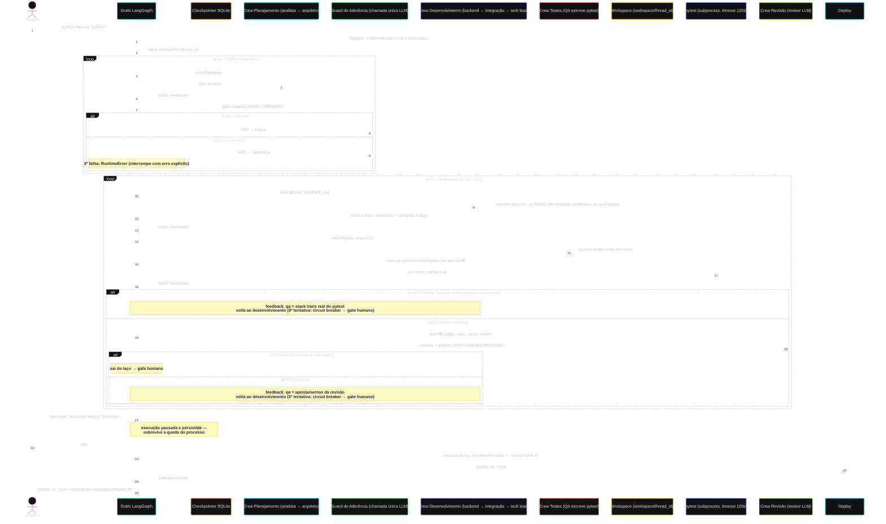

# Arquitetura — Diagrama de Sequência

Fluxo completo de uma execução após as Fases 1–3 do
[roadmap](DESENVOLVIMENTO-REAL.md): o disco (workspace) vira um ator, a
qualidade se divide em três participantes (crew de testes, pytest e crew de
revisão) e o laço de correções é roteado pelo **exit code do pytest** —
vereditos vêm de execução, não de opinião.

## Pontos estruturais

1. **Triagem toca o disco**: `workspace/<thread_id>/` é criado antes de
   qualquer LLM rodar; a entrega vive como arquivos, não como string no
   estado do grafo.
2. **Qualidade em três participantes**: a crew de testes escreve pytest real,
   o pytest executa em nó determinístico (sem LLM) e o revisor LLM cobre o
   que execução não pega — legibilidade, segurança, aderência à spec.
3. **Dois níveis de decisão no laço**: primeiro o exit code (vermelho volta
   ao desenvolvimento com o stack trace real, sem gastar token de revisão);
   só com verde o revisor roda. Aprovação automática = testes verdes **E**
   revisão aprovada.
4. **O grafo lê o disco**: manifesto de arquivos e dump de código vêm de
   varredura determinística do workspace, injetados nas tarefas que decidem
   roteamento (RESILIENCIA.md, item 10).
5. **Circuit breakers**: 2 replanejamentos (depois erro explícito) e 3
   rodadas de correção (depois o gate humano decide).
