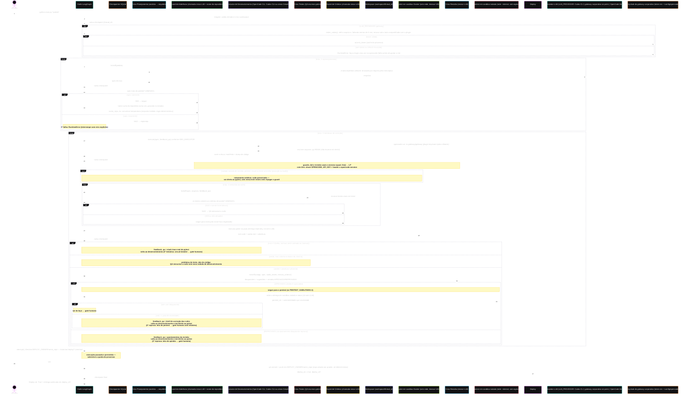

# Arquitetura — Diagrama de Sequência

Fluxo completo de uma execução após as Fases 1–7 do
[roadmap](DESENVOLVIMENTO-REAL.md): o disco (workspace) vira um ator, a
qualidade se divide em quatro participantes (crew de testes, guard de
critérios, pytest e crew de revisão) e o laço de correções é roteado pelo
**exit code do pytest** e pela **cobertura**, executados numa jaula Docker —
vereditos vêm de execução, não de opinião.

## Pontos estruturais

1. **Triagem toca o disco**: `workspace/<thread_id>/` é criado antes de
   qualquer LLM rodar; a entrega vive como arquivos, não como string no
   estado do grafo.
2. **Executor de desenvolvimento intercambiável**: `DEV_EXECUTOR` escolhe
   entre o Codex CLI (padrão), o OpenCode CLI e as crews CrewAI. A governança
   é a mesma nos três casos — o grafo lê o disco, não o texto do executor. A
   tarefa é compartilhada (`adaptadores/tarefa_executor.py`) para a troca de
   executor medir o executor, e não a diferença entre dois prompts.
3. **Qualidade em quatro participantes**: a crew de testes escreve pytest
   real, o guard de critérios confere se a suíte testa o que a spec exige, o
   pytest executa em nó determinístico (sem LLM) e o revisor LLM cobre o que
   execução não pega — legibilidade, segurança, aderência à spec.
4. **Dois níveis de decisão no laço**: primeiro o exit code (vermelho volta
   ao desenvolvimento com o stack trace real, sem gastar token de revisão);
   só com verde o revisor roda. Aprovação automática = testes verdes **E**
   revisão aprovada **E** (quando `PENTEST_HABILITADO=1`) pentest sem vuln
   bloqueante — segurança também por execução, não só opinião do revisor.
5. **Separação entre implementar e validar**: quem escreve o código não
   escreve os testes — o executor é proibido de tocar em `tests/`.
6. **Quem vigia os testes**: verdes não provam correção se a suíte for fraca.
   O **guard de critérios** (semântico, antes de executar) e a **cobertura**
   (determinística, depois) devolvem ao QA num laço curto, sem pagar outra
   rodada de desenvolvimento. A cobertura tem dois pisos — agregado e **por
   módulo** —, porque a média esconde justamente o arquivo central do pedido.
7. **Roteamento seletivo por origem do feedback**: correção nascida de
   revisão, pentest, visual ou **teste vermelho** (asserção ou build) não
   reescreve a suíte — volta ao desenvolvimento e segue direto ao pytest. O
   código mudou, então os testes precisam *rodar* de novo, não ser *escritos*
   de novo; `escrever_testes` é o nó mais caro do grafo. Vermelho de import
   ou coleta volta ao QA, porque aí o teste costuma apontar para o que não
   existe. Quando o QA precisa agir com a suíte já no disco, ele recebe o
   **modo ajuste** — mexer só no que o retorno aponta — e o guard de
   critérios diz o que falta, em vez de mandar reescrever. O revisor recebe o
   próprio veredito anterior e só reprova por apontamento bloqueante, porque
   sinal caro e subjetivo não pode comandar o laço (RESILIENCIA.md, item 27).
8. **Jaula de execução**: código gerado por LLM roda em container efêmero,
   com a entrega montada read-only, sem rede e com limites de recursos —
   `.squad/out` é a única superfície de escrita (relatório de cobertura).
9. **O grafo lê o disco**: manifesto de arquivos e dump de código vêm de
   varredura determinística do workspace, injetados nas tarefas que decidem
   roteamento (RESILIENCIA.md, item 10).
10. **Circuit breakers**: 2 replanejamentos (depois erro explícito), 3
   rodadas de correção (depois o gate humano decide), 2 reescritas da
   suíte (depois segue com o sinal fraco registrado no estado) e 2 rodadas
   por reprovação de revisão (depois o gate humano decide).
11. **Métricas por execução**: cada nó registra duração e veredito em
   `metrics/<thread_id>.json` — incluindo a origem de cada rodada de
   desenvolvimento (inicial, testes ou revisão) —, com resumo impresso ao
   final. Sem isso não há como saber se uma mudança melhorou o resultado.
   Com o Codex, cada nó grava também os tokens gastos, e os marcos da
   execução gravam a cota da conta, lida pelo `codex app-server` sem chamar
   modelo — a diferença entre o primeiro e o último marco é quanto a execução
   custou do plano.
12. **Provedor de LLM intercambiável**: `LLM_PROVEDOR` escolhe entre o
   Codex CLI (`codex`, padrão), o gateway gateway corporativo on-premise (`gateway`) e o
   OpenCode Zen (`zen`), como `DEV_EXECUTOR` escolhe o executor — a
   governança do grafo não depende de quem responde. A configuração em uso é
   **Codex com `gpt-5.6-luna`** nos agentes e no executor: no mesmo pedido
   (calculadora de juros em Next.js), a média caiu de 70,8 min com o OpenCode
   e o gateway corporativo, nunca verde no gate, para 21,4 min, com as execuções mais
   recentes verdes sem intervenção — a medição e as ressalvas estão no item 38
   do [RESILIENCIA.md](RESILIENCIA.md). Com o gateway corporativo a autenticação é
   Keycloak: login interativo uma única vez no OpenCode, depois refresh
   automático sob o mesmo lock do plugin, e o `Authorization` é trocado **por
   request** (um nó longo não fica com token vencido). O token nunca entra no
   repo nem no `.env`. As três superfícies de modelo (`MODEL`,
   `MODEL_FERRAMENTAS`, `OPENCODE_RUN_MODEL`) seguem o provedor; o rollback
   entre provedores é uma linha.
